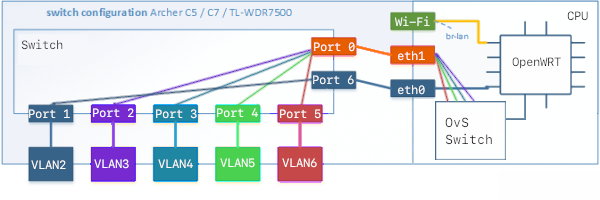
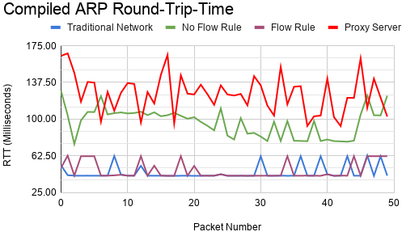
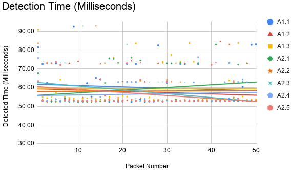

# Intrusion Detection and Prevention and Proxy Hybrid using Software-Defined Networking: ARP Poisoning Defence
Hey! This Github repo is my [MSc Cyber Security](https://www.york.ac.uk/study/postgraduate-taught/courses/msc-cyber-security/) dissertation. This report is developing a system to detect and mitigate poisoned ARP packets by using IDPS and a ARP Proxy hybrid on a Software Defined Networks.

# Abstract
This report investigates and develops an innovative IDPS tailored to function alongside the SDN Ryu controller specifically to detect and prevent a variety of ARP Poisoning attacks. By inspecting ARP packets within the network, inserting specifically crafted Link Layer flow rules on an Open vSwitch (OvS) to actively forward or drop ARP requests and replies. The developed IDPS utilises the network's DHCP server to maintain an autonomous host list, supporting static hosts via ARP packets.
The developed IDPS is a functioning hybrid between IDPS and ARP proxy, by performing ARP replies for malicious devices that are blocked by the IDPS; ensuring traffic in false-positive scenarios.

# The SDN
The figure below is the internal network diagram for the SDN router after configuring Open vSwitch and OpenFlow on an OpenWRT TP-Link Router.

# Results
Testing is carried out on a physical testbed, using an off the shelf TP-Link router with OvS and OpenFlow using several Raspberry Pi's as hosts, resulting in real environment results. Three separate experiments were conducted on the IDPS using the physical testbed. The first experiment tested the detection and mitigation with 400 total packets sent with a variety of ARP poisoning attacks, with prevention rate being 100\% and detected on average within 58.1ms. The developed IDPS had minimal effect of regular ARP packets, only increasing by 1.2ms on average with minimal impact on the Controller resources; see the below figure.

# The Paper
You can view the paper within this github repo [here](paper/Main.pdf)
